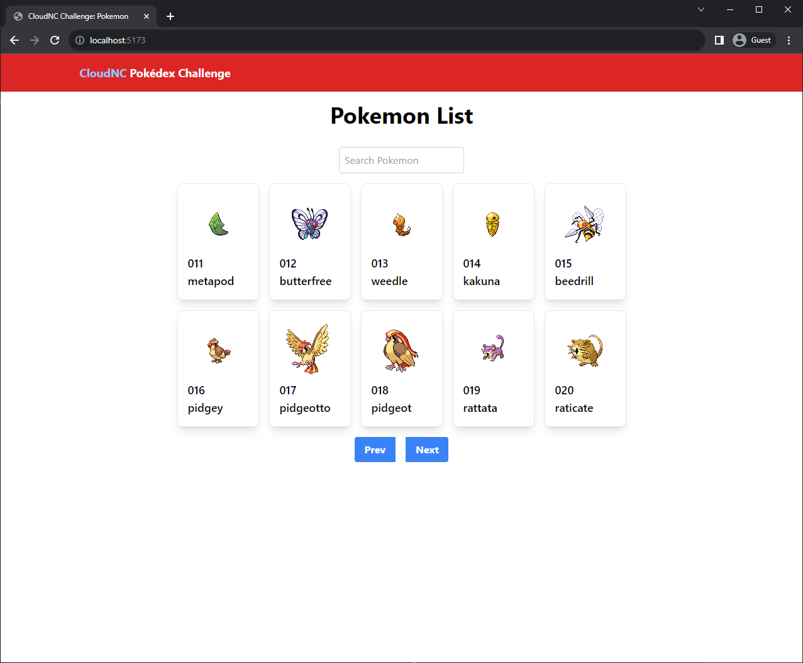
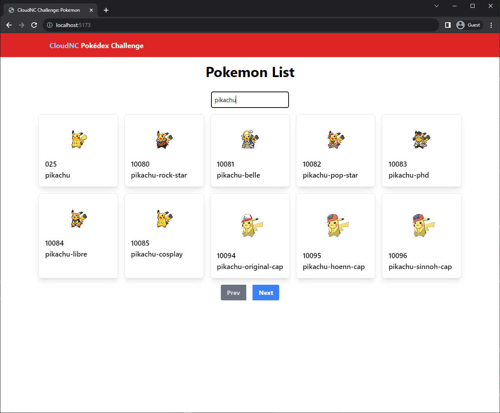

# Frontend Developer Take-Home Assignment: Pokédex Challenge

## Overview

Welcome to the Pokédex Challenge! This project is designed as a take-home assignment for frontend developer candidates to demonstrate their skills in React, API integration, and modern web development practices.

Your task is to build a simple web application that displays a list of Pokémon using data from the [PokeAPI](https://pokeapi.co). The application should include features such as searching, pagination, and displaying details for each Pokémon.

## Requirements

- **Framework:** The application should be built using React.
- **Styling:** You can use any css libraly/framework of your choice.
- **API Integration:** Fetch data from the PokeAPI.
- **Features:**
  - Display a list of Pokémon.
  - Implement search functionality to filter Pokémon by name.
  - Implement pagination.
  - Display an image and details for each Pokémon in a card layout.

## Evaluation Criteria

Your submission will be evaluated based on the following criteria:

- **Functionality:** Does the application work as expected?
- **Code Quality:** Is the code clean, well-organized, and properly commented?

## Screenshots

---
